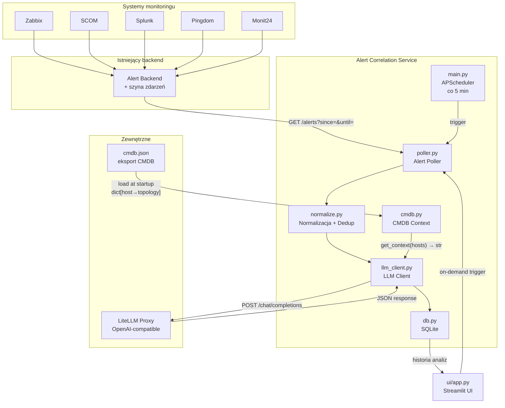
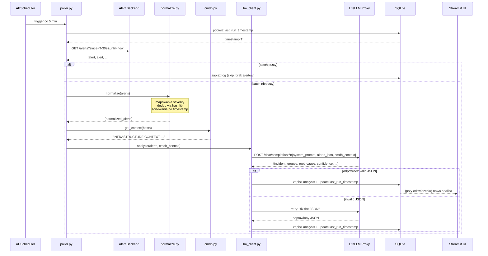
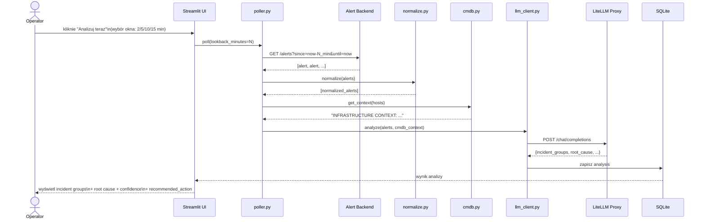

# Diagramy UML — Alert Correlation Service

## 1. Diagram komponentów

```mermaid
graph TB
    subgraph MON["Systemy monitoringu"]
        ZB[Zabbix]
        SC[SCOM]
        SP[Splunk]
        PD[Pingdom]
        M24[Monit24]
    end

    subgraph BK["Istniejący backend"]
        BKS[Alert Backend\n+ szyna zdarzeń]
    end

    subgraph SVC["Alert Correlation Service"]
        SCHED[main.py\nAPScheduler\nco 5 min]
        POLL[poller.py\nAlert Poller]
        NORM[normalize.py\nNormalizacja + Dedup]
        CMDB_M[cmdb.py\nCMDB Context]
        LLM_C[llm_client.py\nLLM Client]
        DB[db.py\nSQLite]
    end

    subgraph EXT["Zewnętrzne"]
        LITELLM[LiteLLM Proxy\nOpenAI-compatible]
        CMDB_F[cmdb.json\neksport CMDB]
    end

    UI[ui/app.py\nStreamlit UI]

    ZB & SC & SP & PD & M24 --> BKS
    BKS -->|"GET /alerts?since=&until="| POLL
    SCHED -->|trigger| POLL
    UI -->|on-demand trigger| POLL
    POLL --> NORM
    NORM --> LLM_C
    CMDB_F -->|"load at startup\ndict[host→topology]"| CMDB_M
    CMDB_M -->|"get_context(hosts) → str"| LLM_C
    LLM_C -->|"POST /chat/completions"| LITELLM
    LITELLM -->|JSON response| LLM_C
    LLM_C --> DB
    DB -->|historia analiz| UI
```

---

## 2. Diagram sekwencji — tryb automatyczny (scheduler)

```mermaid
sequenceDiagram
    participant SCH as APScheduler
    participant POL as poller.py
    participant BK as Alert Backend
    participant NRM as normalize.py
    participant CMB as cmdb.py
    participant LLM as llm_client.py
    participant LTL as LiteLLM Proxy
    participant DB as SQLite
    participant UI as Streamlit UI

    SCH->>POL: trigger co 5 min
    POL->>DB: pobierz last_run_timestamp
    DB-->>POL: timestamp T

    POL->>BK: GET /alerts?since=T-30s&until=now
    BK-->>POL: [alert, alert, ...]

    alt batch pusty
        POL->>DB: zapisz log (skip, brak alertów)
    else batch niepusty
        POL->>NRM: normalize(alerts)
        Note over NRM: mapowanie severity<br/>dedup via hashlib<br/>sortowanie po timestamp
        NRM-->>POL: [normalized_alerts]

        POL->>CMB: get_context(hosts)
        CMB-->>POL: "INFRASTRUCTURE CONTEXT: ..."

        POL->>LLM: analyze(alerts, cmdb_context)
        LLM->>LTL: POST /chat/completions\n{system_prompt, alerts_json, cmdb_context}
        LTL-->>LLM: {incident_groups, root_cause, confidence, ...}

        alt odpowiedź valid JSON
            LLM->>DB: zapisz analysis + update last_run_timestamp
            DB-->>UI: (przy odświeżeniu) nowa analiza
        else invalid JSON
            LLM->>LTL: retry: "fix the JSON"
            LTL-->>LLM: poprawiony JSON
            LLM->>DB: zapisz analysis + update last_run_timestamp
        end
    end
```

---

## 3. Diagram sekwencji — tryb on-demand (operator)

```mermaid
sequenceDiagram
    actor OP as Operator
    participant UI as Streamlit UI
    participant POL as poller.py
    participant BK as Alert Backend
    participant NRM as normalize.py
    participant CMB as cmdb.py
    participant LLM as llm_client.py
    participant LTL as LiteLLM Proxy
    participant DB as SQLite

    OP->>UI: kliknie "Analizuj teraz"\n(wybór okna: 2/5/10/15 min)
    UI->>POL: poll(lookback_minutes=N)

    POL->>BK: GET /alerts?since=now-N_min&until=now
    BK-->>POL: [alert, alert, ...]

    POL->>NRM: normalize(alerts)
    NRM-->>POL: [normalized_alerts]

    POL->>CMB: get_context(hosts)
    CMB-->>POL: "INFRASTRUCTURE CONTEXT: ..."

    POL->>LLM: analyze(alerts, cmdb_context)
    LLM->>LTL: POST /chat/completions
    LTL-->>LLM: {incident_groups, root_cause, ...}
    LLM->>DB: zapisz analysis

    DB-->>UI: wynik analizy
    UI-->>OP: wyświetl incident groups\n+ root cause + confidence\n+ recommended_action
```
